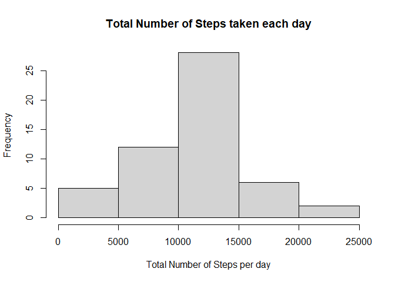
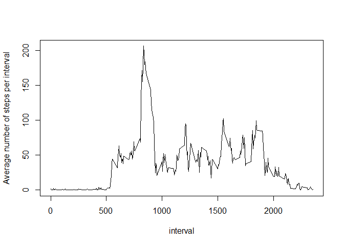
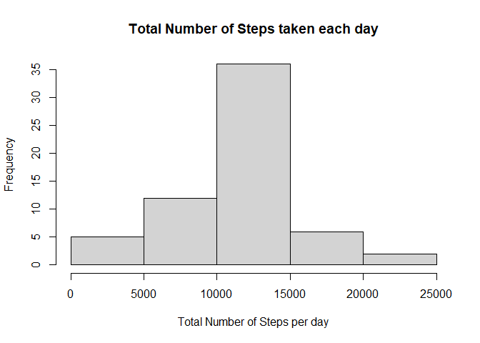
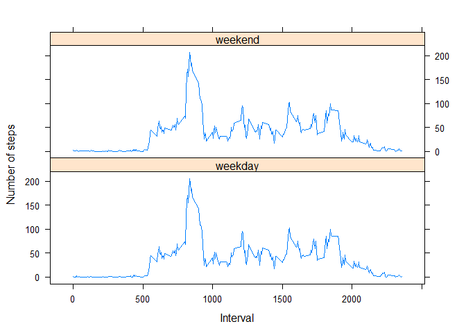

## Introduction

It is now possible to collect a large amount of data about personal movement using activity monitoring devices such as a [Fitbit][1], [Nike Fuelband][2], or [Jawbone Up][3]. These type of devices are part of the "quantified self" movement -- a group of enthusiasts who take measurements about themselves regularly to improve their health, to find patterns in their behavior, or because they are tech geeks. But these data remain under-utilized both because the raw data are hard to obtain and there is a lack of statistical methods and software for processing and interpreting the data.

This assignment makes use of data from a personal activity monitoring device. This device collects data at 5 minute intervals through out the day. The data consists of two months of data from an anonymous individual collected during the months of October and November, 2012 and include the number of steps taken in 5 minute intervals each day.

[1]: https://www.fitbit.com/co/home "Fitbit"
[2]: https://www.nike.com/help/a/why-cant-i-sync "Nike Fuelband"
[3]: https://www.jawbone.com/ "Jawbone Up"

## Data

The data for this assignment can be downloaded from the course web site:

* Dataset: [Activity monitoring data][3] [52K]

The variables included in this dataset are:

* steps: Number of steps taking in a 5-minute interval (missing values are coded as NA)
* date: The date on which the measurement was taken in YYYY-MM-DD format
* interval: Identifier for the 5-minute interval in which measurement was taken

The dataset is stored in a comma-separated-value (CSV) file and there are a total of 17,568 observations in this dataset.

[3]: https://d396qusza40orc.cloudfront.net/repdata%2Fdata%2Factivity.zip "Activity monitoring data"

## Loading and preprocessing the data

For start, the required libraries for the development of this activity will be loaded here:


```r
library(dplyr); library(ggplot2); library(lattice)
```

```
## 
## Attaching package: 'dplyr'
```

```
## The following objects are masked from 'package:stats':
## 
##     filter, lag
```

```
## The following objects are masked from 'package:base':
## 
##     intersect, setdiff, setequal, union
```

Before getting and cleaning the data, a folder called "./data" was created to store the unzipped files. The file that will be used for this assignment will be the loaded into the Forked GitHub, so the data won't be downloaded from the link in the assignment description.


```r
if(!file.exists("data")) {dir.create("data")}
unzip("./activity.zip", exdir = "./data")
## Verify folder creation
list.files()
```

```
##  [1] "activity.zip"                   "data"                          
##  [3] "doc"                            "instructions_fig"              
##  [5] "PA1_template.html"              "PA1_template.md"               
##  [7] "PA1_template.Rmd"               "PA1_template_files"            
##  [9] "Peer_assessment_IvanRomero.Rmd" "README.md"                     
## [11] "RepData_PeerAssessment1.Rproj"
```

```r
## Verify data decompression
list.files(path = "./data")
```

```
## [1] "activity.csv"
```

An initial exploration of the activity.csv file gives the next results


```r
activity <- read.csv("./data/activity.csv", na.strings = "NA")
head(activity, n = 5)
```

```
##   steps       date interval
## 1    NA 2012-10-01        0
## 2    NA 2012-10-01        5
## 3    NA 2012-10-01       10
## 4    NA 2012-10-01       15
## 5    NA 2012-10-01       20
```

```r
summary(activity)
```

```
##      steps            date              interval     
##  Min.   :  0.00   Length:17568       Min.   :   0.0  
##  1st Qu.:  0.00   Class :character   1st Qu.: 588.8  
##  Median :  0.00   Mode  :character   Median :1177.5  
##  Mean   : 37.38                      Mean   :1177.5  
##  3rd Qu.: 12.00                      3rd Qu.:1766.2  
##  Max.   :806.00                      Max.   :2355.0  
##  NA's   :2304
```

As the summary inidicates, the date variable is formatted as character. The next lines of code will be used to change the format of the date variable, calculate the weekday, and merge this column vector called "weekday" into the "activity" data frame.


```r
activity$date <- as.Date(strptime(activity$date, format="%Y-%m-%d"))
day <- weekdays(activity$date)
activity <- cbind(activity,day)
head(activity, n = 5)
```

```
##   steps       date interval   day
## 1    NA 2012-10-01        0 lunes
## 2    NA 2012-10-01        5 lunes
## 3    NA 2012-10-01       10 lunes
## 4    NA 2012-10-01       15 lunes
## 5    NA 2012-10-01       20 lunes
```

```r
summary(activity)
```

```
##      steps             date               interval          day           
##  Min.   :  0.00   Min.   :2012-10-01   Min.   :   0.0   Length:17568      
##  1st Qu.:  0.00   1st Qu.:2012-10-16   1st Qu.: 588.8   Class :character  
##  Median :  0.00   Median :2012-10-31   Median :1177.5   Mode  :character  
##  Mean   : 37.38   Mean   :2012-10-31   Mean   :1177.5                     
##  3rd Qu.: 12.00   3rd Qu.:2012-11-15   3rd Qu.:1766.2                     
##  Max.   :806.00   Max.   :2012-11-30   Max.   :2355.0                     
##  NA's   :2304
```

## What is mean total number of steps taken per day?

1. Make a histogram of the total number of steps taken each day

To calculate the mean total number of steps per day, the functions group_by and summarize from the dplyr package will be used. NA values will be excluded from the analysis in a previous step.  


```r
activitynot_NA <- na.omit(activity)
mean_step_day <- activitynot_NA %>% group_by(date) %>%
                                    summarize(total_steps = sum(steps, na.rm = TRUE))
hist(mean_step_day$total_steps, xlab="Total Number of Steps per day", ylab="Frequency", main="Total Number of Steps taken each day")
```

<!-- -->

2. Calculate and report the mean and median total number of steps taken per day

The mean and median total steps per day are calculated in the following code chunk


```r
mean_step_dayvalue <- mean(mean_step_day$total_steps)
mean_step_dayvalue
```

```
## [1] 10766.19
```

```r
median_step_dayvalue <- median(mean_step_day$total_steps)
median_step_dayvalue
```

```
## [1] 10765
```

The mean total steps per day is **1.0766189\times 10^{4}** and the median total steps per day is **10765**

## What is the average daily activity pattern?

1. Make a time series plot (i.e. type = "l") of the 5-minute interval (x-axis) and the average number of steps taken, averaged across all days (y-axis)

Similarly, the average number of steps taken across all days is calculated with the functions group_by and summarize from the dplyr package omitting NA values


```r
activitynot_NA <- na.omit(activity)
avg_step_interval <- activitynot_NA %>% group_by(interval) %>%
                                    summarize(avg_steps = mean(steps, na.rm = TRUE))

plot(avg_steps~interval, data=avg_step_interval, type="l", ylab="Average number of steps per interval")
```

<!-- -->

```r
interval_maximum_steps <- avg_step_interval[which.max(avg_step_interval$avg_steps),1]
```

2. Which 5-minute interval, on average across all the days in the dataset, contains the maximum number of steps?

The 5-minute interval **835** contains the maximum number of steps, on average across all the days in the dataset.

## Imputing missing values

Note that there are a number of days/intervals where there are missing values (coded as NA). The presence of missing days may introduce bias into some calculations or summaries of the data.

1. Calculate and report the total number of missing values in the dataset (i.e. the total number of rows with NAs)


```r
total_NAvalues <- sum(is.na(activity$steps))
```
The total number of mising values for step variable is **2304**

2. Devise a strategy for filling in all of the missing values in the dataset. The strategy does not need to be sophisticated. For example, you could use the mean/median for that day, or the mean for that 5-minute interval, etc.

The chosen strategy for filling NA values will be by assigning the average interval value to the steps missing value. Initially, activity and avg_step_interval data frames will be merged. A for loop will be implemented to check foir missing values and replacing for the average step value per interval.

```r
activity <- merge(activity,avg_step_interval, by = "interval")
activity <- activity[order(activity$date),]
head(activity)
```

```
##     interval steps       date   day avg_steps
## 1          0    NA 2012-10-01 lunes 1.7169811
## 63         5    NA 2012-10-01 lunes 0.3396226
## 128       10    NA 2012-10-01 lunes 0.1320755
## 205       15    NA 2012-10-01 lunes 0.1509434
## 264       20    NA 2012-10-01 lunes 0.0754717
## 327       25    NA 2012-10-01 lunes 2.0943396
```

```r
for (i in 1:nrow(activity)) {
        if(is.na(activity[i,2])){
                activity[i,2] <- activity[i,5]
        }
}
head(activity)
```

```
##     interval     steps       date   day avg_steps
## 1          0 1.7169811 2012-10-01 lunes 1.7169811
## 63         5 0.3396226 2012-10-01 lunes 0.3396226
## 128       10 0.1320755 2012-10-01 lunes 0.1320755
## 205       15 0.1509434 2012-10-01 lunes 0.1509434
## 264       20 0.0754717 2012-10-01 lunes 0.0754717
## 327       25 2.0943396 2012-10-01 lunes 2.0943396
```

3. Create a new dataset that is equal to the original dataset but with the missing data filled in.

The new dataset is shown next:


```r
activity_newdataset <- select(activity, steps, date, interval)
head(activity_newdataset)
```

```
##         steps       date interval
## 1   1.7169811 2012-10-01        0
## 63  0.3396226 2012-10-01        5
## 128 0.1320755 2012-10-01       10
## 205 0.1509434 2012-10-01       15
## 264 0.0754717 2012-10-01       20
## 327 2.0943396 2012-10-01       25
```

4. Make a histogram of the total number of steps taken each day and Calculate and report the mean and median total number of steps taken per day. Do these values differ from the estimates from the first part of the assignment? What is the impact of imputing missing data on the estimates of the total daily number of steps?

Similarly to the first part of the assignment, the mean/median total number of steps taken per day will be calculated with functions of the dplyr package


```r
mean_step_day_new <- activity_newdataset %>% group_by(date) %>%
                                    summarize(total_steps = sum(steps, na.rm = TRUE))
hist(mean_step_day_new$total_steps, xlab="Total Number of Steps per day", ylab="Frequency", main="Total Number of Steps taken each day")
```

<!-- -->

The mean and median total steps per day are calculated in the following code chunk


```r
mean_step_dayvalue_new <- mean(mean_step_day_new$total_steps)
diff_mean <- mean_step_dayvalue_new - mean_step_dayvalue
mean_step_dayvalue_new
```

```
## [1] 10766.19
```

```r
median_step_dayvalue_new <- median(mean_step_day_new$total_steps)
diff_median <- median_step_dayvalue_new - median_step_dayvalue
median_step_dayvalue_new
```

```
## [1] 10766.19
```

The values for mean total steps per day differ in **0** steps, and the median values in **1.1886792** steps

## Are there differences in activity patterns between weekdays and weekends?

1. Create a new factor variable in the dataset with two levels -- "weekday" and "weekend" indicating whether a given date is a weekday or weekend day.


```r
activity_newdataset <- cbind(activity_newdataset, day)
for (i in 1: nrow(activity_newdataset)) {
        if (activity_newdataset[i,4] %in% c("sábado","domingo")) {
                activity_newdataset[i,4] <- "weekend"
        }
        else{
                activity_newdataset[i,4] <- "weekday"
        }
}
activity_newdataset$day <- as.factor(activity_newdataset$day)

avg_step_interval_new <- activity_newdataset %>% group_by(interval) %>%
                                    summarize(avg_steps = mean(steps, na.rm = TRUE))

activity_newdataset <- merge(activity_newdataset, avg_step_interval_new, by = "interval")
summary(activity_newdataset)
```

```
##     interval          steps             date                 day       
##  Min.   :   0.0   Min.   :  0.00   Min.   :2012-10-01   weekday:12960  
##  1st Qu.: 588.8   1st Qu.:  0.00   1st Qu.:2012-10-16   weekend: 4608  
##  Median :1177.5   Median :  0.00   Median :2012-10-31                  
##  Mean   :1177.5   Mean   : 37.38   Mean   :2012-10-31                  
##  3rd Qu.:1766.2   3rd Qu.: 27.00   3rd Qu.:2012-11-15                  
##  Max.   :2355.0   Max.   :806.00   Max.   :2012-11-30                  
##    avg_steps      
##  Min.   :  0.000  
##  1st Qu.:  2.486  
##  Median : 34.113  
##  Mean   : 37.383  
##  3rd Qu.: 52.835  
##  Max.   :206.170
```

2. Make a panel plot containing a time series plot (i.e. type = "l") of the 5-minute interval (x-axis) and the average number of steps taken, averaged across all weekday days or weekend days (y-axis):


```r
xyplot(avg_steps ~ interval | day, activity_newdataset, type = "l", layout = c(1, 2), 
    xlab = "Interval", ylab = "Number of steps")
```

<!-- -->
